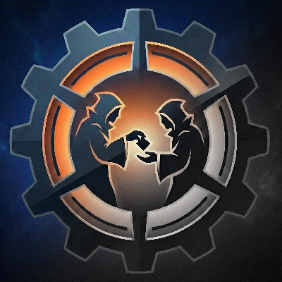

# ZipTrix (Ascension)

<p align="center">
  
</p>

## Overview
**ZipTrix** is a World of Warcraft addon designed specifically for **Project Ascension (3.3.5a Client)**. It provides quality-of-life interface fixes and utilities to streamline your gameplay experience.

---

## Installation Instructions

### Option 1: Easy Install (For Regular Users)
If you just want to play the game with the addon, follow these simple steps:

1. Click the **Code** button (green button near the top right of this page) and select **Download ZIP**.
2. Extract the downloaded ZIP file.
3. Rename the extracted folder from `ZipTrix_Ascension-main` to **`ZipTrix_Ascension`**.
4. Move this folder into your World of Warcraft AddOns directory:
   `...\Project Ascension\resources\client\Interface\AddOns\`
5. Start the game, ensure the addon is enabled, and enjoy!

### Option 2: Clone (For Advanced Users)
If you prefer to use Git to clone the repository directly into your AddOns folder:

Open your terminal or command prompt inside your AddOns folder and run:
```bash
git clone https://github.com/nxpxn/ZipTrix_Ascension.git
```

---

## Primary Features
- **Bagnon Custom Search Filters & Drawer:** Includes a custom drawer for Bagnon with recent search history and pinned terms. Supports custom Ascension search filters such as: `worldforged`, `wf`, `mythic`, `fel-forged`, `felforged`, `awoken`, `realm bound`, `realmbound`, `rb`.
- **MoveAnything and ElvUI Fix:** Resolves conflicts between ElvUI and MoveAnything that can lock the Ascension Character Frame. When enabled, this fix forces the Ascension Character Frame to be movable again.
- **ZipMog Macro Creator:** A built-in utility button that automatically generates a global macro called `ZipMog`. This macro is designed to quickly equip all equippable items in your bags, making it much faster to learn new transmog appearances. The addon also automatically places the macro on your next available action bar slot.
- **Upcoming Features:** Placeholders have been added for upcoming features such as "Branns GTFO".

## Configuration
You can access the ZipTrix configuration panel by opening the standard World of Warcraft Interface Options and navigating to the AddOns tab. From there, you can toggle the Character Frame fix and generate the ZipMog macro.
